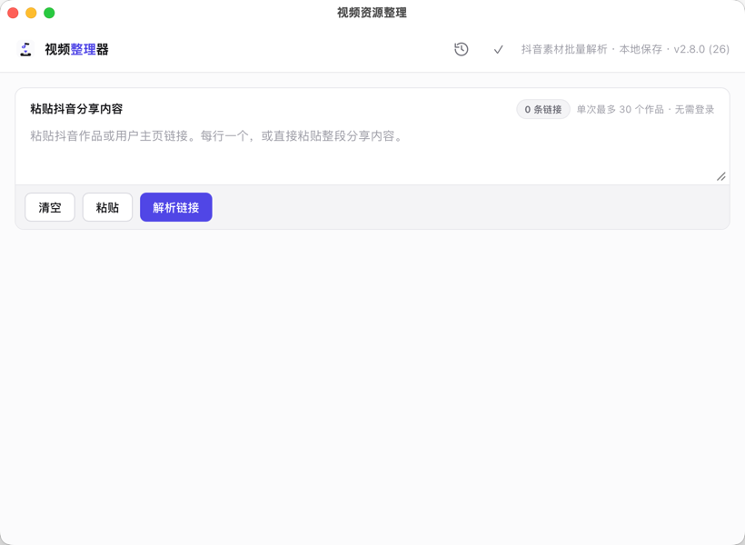
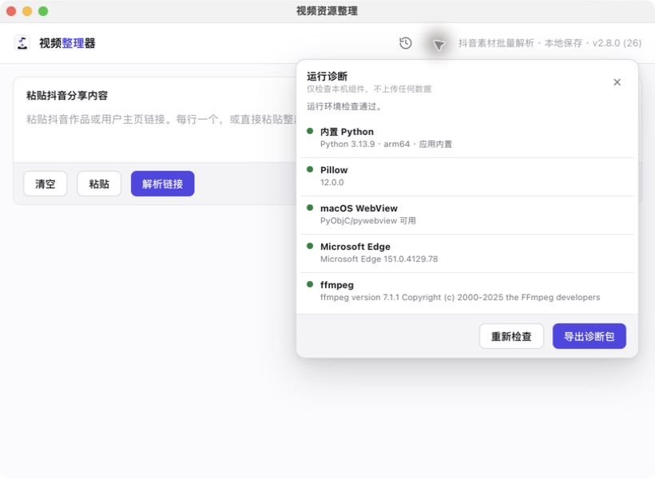

<div align="center">
  
  <h1>视频资源整理</h1>
  <p>面向公开抖音分享链接的本地 macOS 批量解析、筛选与下载工具。</p>
  <p>
    <a href="https://github.com/Aloneswork/short-video-picker/releases/latest"></a>
    <a href="https://github.com/Aloneswork/short-video-picker/actions/workflows/ci.yml"></a>
    <a href="LICENSE"></a>
    
    
  </p>
</div>

当前发行版：**v2.8.3（Build 29）**。应用在本机处理输入、历史、缩略图和下载任务，不需要登录抖音，也不会导入浏览器 Cookie。



## 功能亮点

- 单批最多处理 30 个输入链接或主页作品，支持普通视频、图集、Live 图、`/slides/` 和匿名网页可见的“限时日常”。
- **已知限制：抖音未登录网页渠道已不再下发用户主页的作品列表**（全部官方网页入口实测均为空壳）。主页链接会如实报告 `DY-PROFILE-NO-WORKS` 并附来源诊断，不会把页面推荐内容冒充为账号作品；请改用单个作品分享链接解析。
- 普通视频返回多个公开码率时可选择清晰度，默认使用可识别的最高码率。
- 下载使用稳定 `.part` 文件断点续传；批量失败项可以直接重试。
- 同名文件用 SHA-256 判断内容重复；同名但内容不同的文件会安全改名。
- 缩略图使用限时、随机令牌的本机缓存地址，避免数 MB base64 数据在子进程与 WebView 间传输。
- 最近 1000 条解析记录保存在本机，可搜索、筛选并导出 CSV 或 TXT。
- 运行诊断可检查内置 Python、Pillow、WebView、Edge 和 ffmpeg，并导出脱敏诊断包。
- 解析失败保留明确错误码，可对单条内容原位重新解析。



## 下载与安装

从 [GitHub Releases](https://github.com/Aloneswork/short-video-picker/releases/latest) 下载：

```text
short-video-picker-v2.8.1-macOS-arm64.zip
```

当前预编译版本仅面向 **Apple Silicon（arm64）** 和 **macOS 12 及以上**。解压后将 `视频资源整理.app` 拖入“应用程序”文件夹，再双击运行。正式应用已经内置 Python、Pillow、pywebview 和所需 macOS 框架绑定，目标 Mac 不需要预装 Python。

当前公开包使用 ad-hoc 临时签名，尚未经过 Apple Developer ID 公证。如果 macOS 阻止首次打开，请在 Finder 中按住 Control 点击应用，选择“打开”，核对应用名称后再次确认。不要关闭系统级安全保护，也不要运行来源不明的副本。下载后可以校验 SHA-256：

```sh
shasum -a 256 short-video-picker-v2.8.1-macOS-arm64.zip
```

期望值见同一 Release 的 `SHA256SUMS.txt`。

## 使用说明

1. 在抖音复制公开作品或用户主页的分享内容。
2. 打开应用，将一条或多条分享内容粘贴到输入框；可以每行一条，也可以直接粘贴整段分享文案。
3. 点击“解析链接”，等待各条结果出现。
4. 按需筛选视频或图片、选择视频清晰度，并勾选要保存的资源。
5. 选择保存位置，点击“保存已选资源”。如有失败项，可在底部直接重试。
6. 顶栏左侧时钟按钮可查看、搜索和导出本地解析记录；诊断按钮可检查当前运行环境。

应用不会绕过私密、好友、付费、登录可见或已删除内容。页面结构变化、区域差异或频率限制都可能导致公开解析失效；请在 Issue 中附上错误码和经过脱敏的最小复现信息。

## 运行依赖与降级行为

- **Microsoft Edge**：复杂作品页面的可选兜底。没有 Edge 时仍会尝试官方公开分享页，但覆盖率可能下降。
- **ffmpeg**：只用于没有公开封面时的视频首帧预览和部分图片指纹兜底。缺失不会阻止媒体解析和保存，但这类预览可能为空。
- **Pillow**：已经随应用打包，不依赖 macOS `sips` 或用户手动安装。

应用界面由 pywebview 提供。pywebview 和缩略图缓存服务都只绑定随机端口的 `127.0.0.1`，不向局域网或公网开放。

## 数据与隐私

| 数据 | 默认位置 |
| --- | --- |
| 轮转日志 | `~/Library/Logs/视频资源整理/app.log` |
| 解析历史 | `~/Library/Application Support/视频资源整理/parse_history.sqlite3` |
| 缩略图缓存 | `~/Library/Caches/视频资源整理/previews` |

日志上限为 1 MB，保留 5 个备份；URL 查询参数和无关路径会脱敏。诊断包只包含运行环境摘要和脱敏日志，不包含 Cookie、浏览器配置或媒体文件。

## 反馈、建议与贡献

- 遇到可复现的问题：[提交 Bug](https://github.com/Aloneswork/short-video-picker/issues/new?template=bug_report.yml)
- 希望增加或改进功能：[提出建议](https://github.com/Aloneswork/short-video-picker/issues/new?template=feature_request.yml)
- 一般问题、经验分享和未成形的想法：[参与 Discussions](https://github.com/Aloneswork/short-video-picker/discussions)
- 准备贡献代码：阅读 [CONTRIBUTING.md](CONTRIBUTING.md)
- 发现安全漏洞：按 [SECURITY.md](SECURITY.md) 私下报告，不要创建公开 Issue

请勿在公开 Issue 中提交 Cookie、令牌、个人路径、真实用户媒体或无权公开的链接。

## 支持项目

如果这个工具帮你节省了时间，欢迎查看 [加密货币赞助说明](SPONSORSHIP.md)。赞助完全自愿，不影响软件功能，也不构成购买、投资、商业授权或技术支持合同。提出建议、报告问题、完善文档和分享项目同样是在支持维护。

## 从源码运行

要求 macOS 12+、Python 3.13；构建和 CI 的 JavaScript 语法检查还需要 Node.js 22。

```sh
git clone https://github.com/Aloneswork/short-video-picker.git
cd short-video-picker
python3.13 -m venv .venv
source .venv/bin/activate
python -m pip install -r requirements-dev.txt
python desktop.py
```

测试：

```sh
python -m pytest -q -p no:cacheprovider
```

构建自包含应用：

```sh
PYTHON_BIN="$PWD/.venv/bin/python" ./build_macos_app.sh
```

`vendor/` 只是本机可选依赖镜像，不会上传 GitHub；默认构建使用 `requirements-macos.txt` 中锁定的独立环境。只有显式设置 `USE_LOCAL_VENDOR=1` 才会读取本机镜像。版本号、Build 和公共上限以 `version.json` 为单一来源。默认构建使用 ad-hoc 签名；如已配置 Developer ID 和公证钥匙串配置，可使用：

```sh
SIGN_IDENTITY="Developer ID Application: ..." \
NOTARY_PROFILE="profile-name" \
./build_macos_app.sh
```

完整开发约定见 [CONTRIBUTING.md](CONTRIBUTING.md)。

## 项目范围与免责声明

本工具只读取公开网页已经返回的资源，不登录、不导入 Cookie，也不绕过访问控制。请只保存你拥有、已获授权，或平台规则和当地法律允许保存的内容。项目与抖音及其关联公司无隶属、授权或背书关系。

本项目目前专注 macOS 与抖音公开分享链接；Windows 版本尚未提供。现有实现保留自有 CDP 客户端与抖音专用解析结构，没有引入 Playwright，也没有抽象多平台适配器。

## 许可证

项目源码采用 [MIT License](LICENSE) 开源。第三方组件继续适用各自许可证，详见 [THIRD_PARTY_NOTICES.md](THIRD_PARTY_NOTICES.md)。
